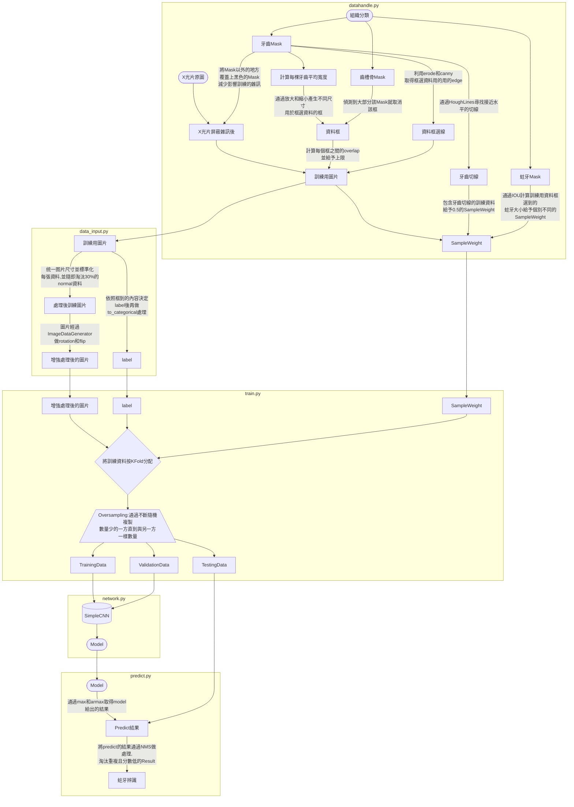

# Simple CNN

## Result on Caries

| TP | TN | FP | FN | Sensitivity | Precision | F1 | Accuracy |
|:----------:|:----------:|:----------:|:----------:|:----------:|:----------:|:----------:|:----------:|
| 12 | 501 | 3 | 13 | 48% | 80% | 60% | 96.98% |

## Introduction of each file

> process/urljson.py

將url上的資料都轉成json文件，以避免生成訓練資料時中斷

> process/datahandle.py

通過json取得牙齒，齒槽骨和蛀牙的等mask取出，並依照這些mask在augmentation後crop出訓練用的資料

> process/data_input.py

用model/train.py訓練時將訓練資料做預處理以及歸一化等，再用做訓練(train.py會直接使用，不需要呼叫)

> model/train.py

配合network.py以及process/data_input.py直接訓練，並在這裡對不同數量的normal和caries資料做oversampling以及augmentation

> predict/predict.py

利用model/train.py分割好的testing資料，以及生成的folded model個別做測試，並以nms做處理

## Introduction to the Edge Frame Detection

### 資料處理:	

> 為了避免框到兩側的雜訊以及牙根的部分，對牙齒的邊緣做了刪減的處理

### 資料框選:	

> 通過計算每顆牙齒的平均寬度，找出適合他的框的大小，再通過放大及縮小去產生不同的訓練資料

> 針對Caries資料的部分，每一個框裡蛀牙所佔的大小，以及被框到的蛀牙佔一整塊蛀牙的比例都不一樣，會對訓練造成影響，所以在這裡我們需要給予不同的資料各自的Sample Weight來調整訓練效果 

| 框內蛀牙面積 | 蛀牙在蛀牙區域的面積 | Sample Weight | Label |
|:----------:|:----------:|:----------:|:----------:|
| >= 40% | >= 40% | 1.5 | Caries |
| >= 5% | >= 40% | 1 | Caries |
| >= 40% | >= 5% | 0.6 | Caries |
| >= 5% | >= 5% | 0.1 | Caries |
| >= 1% | >= 1% | 0.05 | Caries |
| <  1% | <  1% | 0.95 | Normal |

> 因為大部分Caries都是在牙齒兩側，為了加強兩側的訓練，我們在給予資料Sample Weight時按照Hough Line Detection得到的頂部資料乘上0.5以達到削弱的效果

### 程式流程圖:

