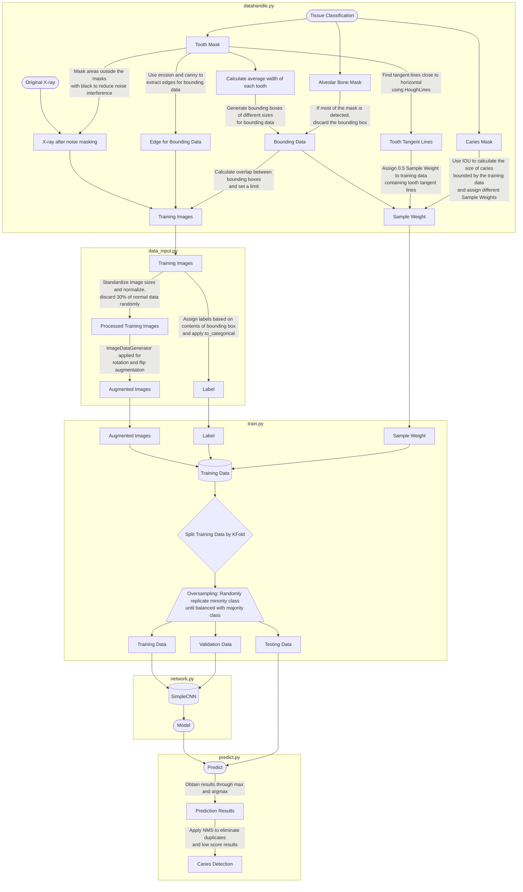

# Simple CNN

## Result on Caries

| TP | TN | FP | FN | Sensitivity | Precision | F1 | Accuracy |
|:----------:|:----------:|:----------:|:----------:|:----------:|:----------:|:----------:|:----------:|
| 12 | 501 | 3 | 13 | 48% | 80% | 60% | 96.98% |

## Introduction of Each File

> process/urljson.py

Converts data from URLs into JSON files to avoid interruptions when generating training data.

> process/datahandle.py

Extracts masks of teeth, alveolar bone, and caries from JSON data, then crops training data based on these masks after augmentation.

> process/data_input.py

Preprocesses and normalizes training data when training with model/train.py (automatically called by train.py, no need for manual invocation).

> model/train.py

Works with network.py and process/data_input.py for training. Also handles oversampling and augmentation of different amounts of normal and caries data.

> predict/predict.py

Tests the folded models using the split testing data from model/train.py and applies Non-Maximum Suppression (NMS) to process the results.

## Introduction to the Edge Frame Detection

### Data Processing:

> To avoid noise and parts of the tooth root on both sides, edge reduction was applied to the teeth.

### Data Cropping:

> The average width of each tooth was calculated to determine the appropriate bounding box size, and different training data was generated through scaling.

> For caries data, the size of the caries within each bounding box and the proportion of the caries covered in the entire lesion vary, affecting training. Therefore, different sample weights were assigned to adjust the training effect.

| Caries Area in Box | Proportion of Caries in Lesion Area | Sample Weight | Label |
|:----------:|:----------:|:----------:|:----------:|
| >= 40% | >= 40% | 1.5 | Caries |
| >= 5% | >= 40% | 1 | Caries |
| >= 40% | >= 5% | 0.6 | Caries |
| >= 5% | >= 5% | 0.1 | Caries |
| >= 1% | >= 1% | 0.05 | Caries |
| <  1% | <  1% | 0.95 | Normal |

> Since most caries occur on the sides of teeth, side training is enhanced by reducing the sample weight for top data, based on Hough Line Detection, by 0.5.

### Program Flow Diagram:

